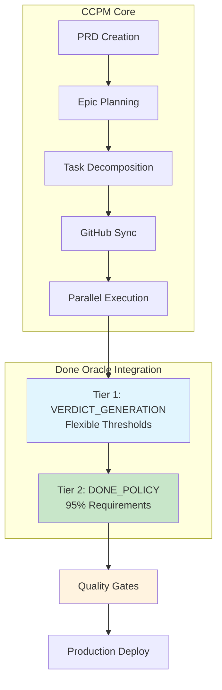
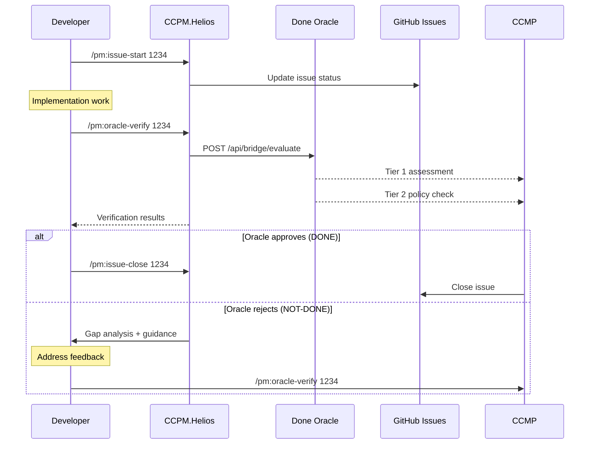

# CCPM.Helios - AI-Powered Project Management with Done Oracle Integration

[](https://automaze.io)
&nbsp;
[](https://github.com/automazeio/ccpm/blob/main/README.md)
[](https://github.com/automazeio/ccpm)
&nbsp;
[](https://github.com/automazeio/ccpm/blob/main/LICENSE)
&nbsp;
[](https://github.com/good-night-oppie/ccpm.helios)

**Enterprise-grade project management system combining spec-driven development, AI-powered task validation, and intelligent quality gates through Done Oracle's two-tier architecture.**

## System Overview

CCPM.Helios transforms traditional development workflows through:

- **Spec-Driven Architecture**: PRDs → Epics → GitHub Issues → Production Code
- **Done Oracle Integration**: Two-tier AI validation (VERDICT_GENERATION + DONE_POLICY)
- **Parallel Execution Engine**: Multiple AI agents on independent task streams
- **Quality Gates**: 95% confidence requirements with comprehensive audit trails
- **Context Preservation**: Zero knowledge loss across development sessions


## Architecture Diagram



## Table of Contents

- [Quick Start](#quick-start)
- [Done Oracle Integration](#done-oracle-integration)
- [System Architecture](#system-architecture)
- [API Reference](#api-reference)
- [Command Reference](#command-reference)
- [Quality Assurance](#quality-assurance)
- [Development Workflow](#development-workflow)
- [Deployment Guide](#deployment-guide)
- [Troubleshooting](#troubleshooting)

## Quick Start

### Prerequisites

```bash
# Core Dependencies
node >= 18.0.0
npm >= 8.0.0
git >= 2.30.0

# Done Oracle Service (Required for AI verification)
# Install from: https://github.com/good-night-Oppie/oppie-done-oracle
curl -s http://localhost:3000/health  # Should return 200
```

### Installation

```bash
# Clone and install
git clone https://github.com/good-night-oppie/ccpm.helios.git
cd ccpm.helios
npm install

# Initialize project management system
/pm:init

# Create your first PRD
/pm:prd-new feature-name
```

### Verification

```bash
# Test Oracle integration
/pm:oracle-verify --health-check

# Validate system setup
/pm:validate

# Run comprehensive checks
npm run validate
```

## Done Oracle Integration

### Two-Tier Quality Architecture

CCPM.Helios integrates with **Done Oracle v2.0** providing intelligent, AI-powered task completion verification through a sophisticated two-tier system:

#### Tier 1: VERDICT_GENERATION
- **Purpose**: Initial pass/fail assessment with flexible thresholds
- **Thresholds**:
  - Confidence: 90%
  - Completion: 85%
  - Quality: 85%
  - Testing: 90%
  - Security: 95% (always strict)
  - Performance: 80%

#### Tier 2: DONE_POLICY
- **Purpose**: Final quality gate for production readiness
- **Thresholds**: 95% across ALL metrics (confidence, completion, quality, test, security, performance)
- **Gate**: Only tasks meeting Tier 2 requirements receive `DONE` verdict

### Oracle API Integration

```javascript
// Oracle evaluation request
POST http://localhost:3000/api/bridge/evaluate
{
  "repo": "/path/to/repository",
  "context": {
    "task": "Task verification",
    "description": "Implementation details",
    "type": "manual_verification_check",
    "verification_source": "ccpm_oracle_verify"
  },
  "metadata": {
    "task_number": "1234",
    "verification_type": "manual_check",
    "command": "oracle-verify"
  }
}

// Oracle response structure
{
  "verdict": "DONE|NOT-DONE",
  "confidence": 0.95,
  "donePolicyMet": true,
  "tier": "2",
  "reasoning": "Detailed explanation...",
  "processingPath": "analysis_method",
  "complexity": 0.8,
  "gapAnalysis": {},
  "guidance": null
}
```

### Quality Metrics

| Metric | Tier 1 | Tier 2 | Purpose |
|--------|---------|---------|---------|
| **Confidence** | 90% | 95% | Overall implementation confidence |
| **Completion** | 85% | 95% | Feature completeness |
| **Quality** | 85% | 95% | Code quality and maintainability |
| **Testing** | 90% | 95% | Test coverage and validation |
| **Security** | 95% | 95% | Security compliance (always strict) |
| **Performance** | 80% | 95% | Performance requirements |

## System Architecture

### Project Structure

```
.claude/
├── commands/          # Command definitions
│   ├── pm/           # Project management commands
│   │   ├── oracle-status.md    # Oracle verification status
│   │   ├── oracle-verify.md    # Manual task verification
│   │   └── ...       # Core PM commands
├── epics/            # Epic workspace (gitignored)
│   └── [epic-name]/  # Epic and related tasks
│       ├── epic.md   # Implementation plan
│       ├── [#].md    # Individual task files
│       └── updates/  # Work-in-progress updates
│           └── [task#]/
│               └── oracle-verification-*.json  # Audit trail
├── prds/             # Product Requirements Documents
├── scripts/          # Automation scripts
│   └── pm/           # Project management scripts
│       ├── oracle-status.sh     # Oracle verification runner
│       └── oracle-verify.sh     # Task verification runner
└── context/          # Project-wide context files
```

### Integration Points

1. **Command Layer**: Oracle commands integrated into PM command set
2. **Execution Layer**: Scripts call Oracle API for validation
3. **Storage Layer**: Verification records stored with audit trails
4. **Workflow Layer**: Quality gates integrated into task lifecycle

## API Reference

### Oracle Commands

#### `/pm:oracle-status <epic>`
Show Done Oracle verification status for all tasks in an epic.

**Usage:**
```bash
/pm:oracle-status memory-system
```

**Response:**
```
📊 Done Oracle Status for Epic: memory-system
═══════════════════════════════════════════════════════

🎯 Task 1234: Implement caching layer
   Local Status: completed
   Oracle Status: ✅ DONE (confidence: 0.96, tier: 2, path: comprehensive)

🎯 Task 1235: Add monitoring endpoints
   Local Status: in-progress
   Oracle Status: ❌ NOT DONE (confidence: 0.82, tier: 1, path: basic)

📈 Epic Summary Statistics
═══════════════════════════════════════════════════════
📊 Total Tasks: 2
✅ Oracle Verified DONE: 1
❌ Oracle Verified NOT DONE: 1
🎯 Epic Completion: 50.0% Oracle-verified
```

#### `/pm:oracle-verify <task>`
Manually verify task completion with Done Oracle without closing the task.

**Usage:**
```bash
/pm:oracle-verify 1234
```

**Response:**
```
📋 Done Oracle Verification Results for Task 1234
═══════════════════════════════════════════════════════

🎯 Verdict: DONE
📊 Confidence: 0.96
🏛️ Tier: 2
📋 Done Policy Met: True
🧠 Processing Path: comprehensive
⚖️ Complexity Score: 0.8

💭 Oracle Reasoning:
Implementation demonstrates complete functionality with comprehensive
test coverage, proper error handling, and security considerations...

✅ ORACLE VERDICT: TASK COMPLETE
   Task 1234 meets Done Oracle completion standards (Tier 2)
   All DONE policy requirements satisfied
   Ready for closure with: /pm:issue-close 1234
```

## Command Reference

### Core PM Commands

| Command | Description | Oracle Integration |
|---------|-------------|-------------------|
| `/pm:init` | Initialize PM system | Sets up Oracle connection |
| `/pm:prd-new <name>` | Create Product Requirements | - |
| `/pm:prd-parse <name>` | Convert PRD to epic | - |
| `/pm:epic-decompose <name>` | Break epic into tasks | - |
| `/pm:epic-sync <name>` | Push to GitHub | - |
| `/pm:issue-start <id>` | Begin work on task | Oracle verification on completion |
| `/pm:issue-close <id>` | Mark task complete | Oracle verification required |
| `/pm:oracle-status <epic>` | **Show Oracle verification status** | ✅ Full integration |
| `/pm:oracle-verify <task>` | **Manual Oracle verification** | ✅ Full integration |

### Workflow Commands

| Command | Purpose | Oracle Impact |
|---------|---------|---------------|
| `/pm:next` | Show next priority task | Considers Oracle status |
| `/pm:status` | Project dashboard | Includes Oracle metrics |
| `/pm:standup` | Daily standup report | Oracle verification stats |
| `/pm:blocked` | Show blocked tasks | Oracle feedback analysis |

## Quality Assurance

### Testing Strategy

```bash
# Run all tests
npm test

# Test Oracle integration
npm run test:oracle

# Coverage report
npm run test:coverage

# Integration tests
npm run test:integration
```

### Validation Pipeline

1. **Static Analysis**: ESLint, TypeScript checking
2. **Unit Tests**: Jest test suites
3. **Oracle Verification**: Two-tier validation
4. **Integration Tests**: End-to-end workflows
5. **Security Scan**: Vulnerability assessment

### Quality Gates

- **Tier 1 Gate**: Basic functionality validation (flexible thresholds)
- **Tier 2 Gate**: Production readiness (95% requirements)
- **Security Gate**: Always enforced at 95% threshold
- **Performance Gate**: Load testing and optimization

## Development Workflow

### Standard Development Cycle

```bash
# 1. Start new feature
/pm:prd-new feature-name

# 2. Plan implementation
/pm:prd-parse feature-name

# 3. Break into tasks
/pm:epic-decompose feature-name

# 4. Push to GitHub
/pm:epic-sync feature-name

# 5. Start development
/pm:issue-start 1234

# 6. Verify with Oracle
/pm:oracle-verify 1234

# 7. Close when Oracle approves
/pm:issue-close 1234
```

### Oracle-Enhanced Workflow



### Best Practices

1. **Always verify before closing**: Use `/pm:oracle-verify` before `/pm:issue-close`
2. **Monitor epic health**: Regular `/pm:oracle-status` checks
3. **Address gaps promptly**: Oracle provides specific guidance for improvements
4. **Maintain audit trails**: All verifications stored in `.claude/epics/*/updates/`
5. **Respect quality gates**: Don't bypass Oracle recommendations

## Deployment Guide

### Environment Setup

```bash
# Development environment
NODE_ENV=development
ORACLE_ENDPOINT=http://localhost:3000
ORACLE_TIMEOUT=30000

# Production environment
NODE_ENV=production
ORACLE_ENDPOINT=https://oracle.prod.internal
ORACLE_TIMEOUT=60000
ORACLE_AUTH_TOKEN=xxx
```

### Done Oracle Service

```bash
# Start Oracle service
done-oracle --port 3000 --health-check

# Or via Docker
docker run -p 3000:3000 done-oracle:latest

# Verify service
curl -s http://localhost:3000/health
```

### System Dependencies

```json
{
  "engines": {
    "node": ">=18.0.0",
    "npm": ">=8.0.0"
  },
  "dependencies": {
    "@anthropic-ai/claude-code": "^1.0.0",
    "done-oracle-client": "^2.0.0"
  }
}
```

## Troubleshooting

### Common Issues

#### Oracle Service Unavailable
```bash
# Check service health
curl -s http://localhost:3000/health

# Restart service
pm2 restart done-oracle

# Check logs
pm2 logs done-oracle
```

#### Verification Failures
```bash
# Check Oracle configuration
/pm:validate

# Test Oracle connection
/pm:oracle-verify --health-check

# Review verification logs
cat .claude/epics/*/updates/*/oracle-verification-*.json
```

#### Quality Gate Issues
- **Tier 1 failures**: Review basic implementation requirements
- **Tier 2 failures**: Address comprehensive quality standards
- **Security failures**: Always required at 95% - review security practices
- **Performance failures**: Optimize code and run performance tests

### Error Codes

| Code | Issue | Resolution |
|------|-------|------------|
| `ORACLE_UNAVAILABLE` | Service not running | Start Oracle service |
| `TIER_1_FAILURE` | Basic validation failed | Review implementation |
| `TIER_2_FAILURE` | Quality gate not met | Address comprehensive requirements |
| `SECURITY_VIOLATION` | Security threshold not met | Review security practices |
| `TIMEOUT_ERROR` | Oracle request timeout | Check network/service health |

### Support & Documentation

- **API Documentation**: [Oracle API Docs](./docs/oracle-api.md)
- **Architecture Guide**: [System Architecture](./docs/architecture.md)
- **Best Practices**: [Development Guide](./docs/development.md)
- **Troubleshooting**: [Common Issues](./docs/troubleshooting.md)

---

## Contributing

We welcome contributions! Please see our [Contributing Guide](CONTRIBUTING.md) for details.

### Development Setup

```bash
git clone https://github.com/good-night-oppie/ccpm.helios.git
cd ccpm.helios
npm install
npm run setup:dev
```

## License

MIT License - see [LICENSE](LICENSE) file for details.

## Acknowledgments

- **Done Oracle**: AI-powered task completion verification
- **Claude Code**: AI-assisted development platform
- **Automaze.io**: Project management innovation

---

**🤖 Enhanced with Done Oracle Two-Tier Architecture**
**📊 Quality-First Development with AI Verification**
**🚀 Enterprise-Ready Project Management**